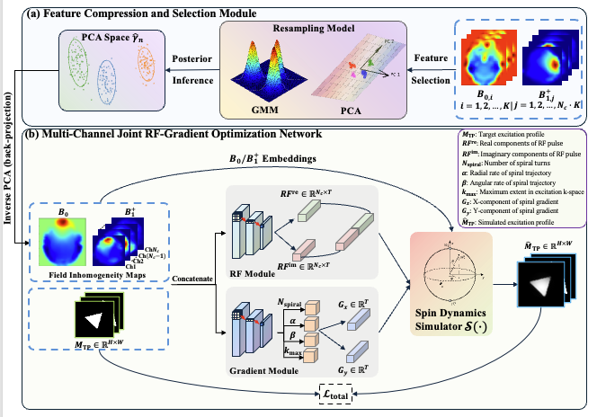

<h2 align="center"> [MRM2026] SelExNet: A Self-Supervised Physics-Informed Framework for Multi-Channel Joint RF and Gradient Waveform Optimization in 2D Spatially Selective Excitation </h2>

  <a href='https://scholar.google.com/citations?user=e1nU4X0AAAAJ' target='_blank'><strong>Yuliang Xiao</strong></a> 1,2,&thinsp; 
  <a href='https://orcid.org/0009-0003-9203-7344' target='_blank'><strong>Jason Rock</strong></a> 1,2,&thinsp; 
  <a href='https://scholar.google.com/citations?user=NR-5WkIAAAAJ&hl=en' target='_blank'><strong>Zhe Wu</strong></a> 3,&thinsp; 
  <a href='https://scholar.google.com/citations?user=--juSrQAAAAJ&hl=en' target='_blank'><strong>Jamie Near</strong></a> 1,2,&thinsp; 
  <a href='https://scholar.google.ca/citations?hl=en&user=o8pzV3YAAAAJ' target='_blank'><strong>Mark Chiew</strong></a> 1,2,&thinsp; 
  <a href='https://scholar.google.ca/citations?user=wFnB60gAAAAJ&hl=en' target='_blank'><strong>Simon J. Graham</strong></a> 1,2</em>

  1 Sunnybrook Research Institute&ensp; 2 University of Toronto&ensp;  
  3 Siemens Healthineers Limited&ensp;

  <a href="#news">News</a> |
  <a href="#abstract">Abstract</a> |
  <a href="#installation">Installation</a> |
  <a href="#train">Train</a> |
  <a href="#finetune">Finetune</a>

## News

**2026.05.02** - Our paper is accepted by **Magnetic Resonance in Medicine 2026**. Work in progress.

## Abstract

SelExNet is a self-supervised framework for 2D spatially selective excitation that jointly optimizes radiofrequency (RF) pulses and gradient waveforms, with extension to multi-channel transmission MRI. It couples neural RF and gradient generators with a differentiable Bloch simulator, enabling pulse optimization directly from desired excitation outcomes without requiring pre-designed target pulses.

The framework designs RF pulses and parameterized variable-density spiral gradient waveforms for both single- (sTx) and multi-channel (pTx) transmission, and supports patient-specific adaptation using measured, previously unseen <em>B</em>0 and
<em>B</em>1+ maps. Joint RF-Gradient optimization improves excitation fidelity over RF-only optimization. In phantom experiments, patient-specific fine-tuning restores target geometry and uniformity under field inhomogeneity. In-vivo studies demonstrate anatomically precise excitation, sharper target boundaries, and reduced off-target signal.

   
  <b>Figure 1: Overview of SelExNet Framework.</b>

